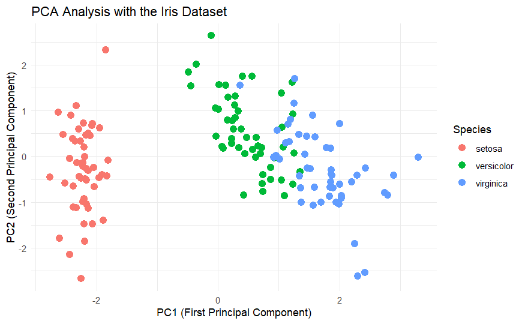
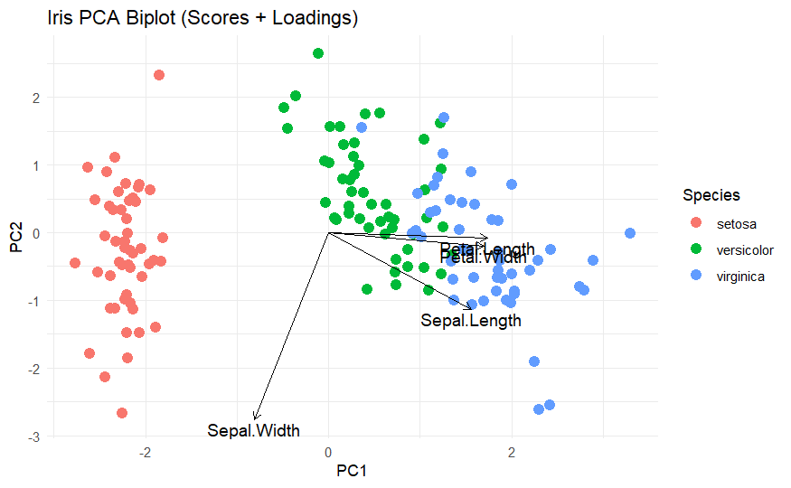

Live tutorial:  
https://oguzhanisilay8.github.io/iris-pca-r/

# PCA Analysis with the Iris Dataset

This project shows a simple example of **Principal Component Analysis (PCA)** using the **iris dataset** in **R**.

The goal of this tutorial is to help beginners understand:

- what PCA is  
- how to run PCA in R  
- how to visualize PCA results  
- how to interpret PCA plots  

This repository is designed as a **simple learning example** for students interested in **data analysis and bioinformatics**.

---

## Example Output

Below is an example PCA visualization generated from the iris dataset.

The PCA plot reduces the dataset to two principal components (PC1 and PC2), allowing us to visualize patterns between samples.7

---

# PCA Visualization

The following PCA plot shows how the three iris species are distributed in reduced dimensional space.

From the plot we can observe:

- **Setosa** forms a clearly separate cluster  
- **Versicolor** and **Virginica** are closer to each other  
- Some overlap can occur between **versicolor** and **virginica**

This happens because their measurements are more similar.

---

# PCA Biplot

A **PCA biplot** shows both **samples** and **variables** in the same plot.

- Points represent samples (flowers)
- Arrows represent variables (measurements)

This helps us understand **which variables contribute to the separation of samples**.

From the biplot we can observe:

- **Petal.Length** and **Petal.Width** strongly influence the separation
- **Setosa** is clearly separated from the other species
- **Versicolor** and **Virginica** are closer and may overlap

---

# Tutorial Page

You can open the full tutorial here:

https://oguzhanisilay8.github.io/iris-pca-r/

---

# Repository Structure

iris-pca-r

- iris-pca-analysis.Rmd → PCA tutorial  
- iris-pca-biplot.Rmd → PCA biplot tutorial  
- README.md → project description  
- docs/index.html → rendered PCA tutorial page  
- docs/iris-pca-biplot.html → rendered PCA biplot tutorial page  
- docs/pca-iris-plot.png → PCA visualization image  
- docs/pca-biplot-iris.png → PCA biplot visualization  

---

# Methods Used

This tutorial demonstrates basic concepts used in data analysis:

- Principal Component Analysis (PCA)
- PCA biplot visualization
- Data visualization with ggplot2
- Dimensionality reduction
- Exploratory data analysis

---

# Dataset

This project uses the **iris dataset**, which is included in **R**.

### Dataset characteristics

- **150 observations (flowers)**

- **3 species**
  - setosa
  - versicolor
  - virginica

- **4 numeric measurements**

  - Sepal Length
  - Sepal Width
  - Petal Length
  - Petal Width

These measurements are used to perform **Principal Component Analysis (PCA)**.

---

# Tools

- R  
- R Markdown  
- ggplot2  
- GitHub  
- GitHub Pages  

---

## Learning Goals

This project helps beginners learn the following concepts:

- how dimensionality reduction works
- how PCA transforms high dimensional data
- how to visualize PCA results in R
- how to interpret clustering patterns in biological datasets

---

## Future Improvements

Possible extensions of this project include:

- PCA scree plot analysis
- variance explained visualization
- clustering analysis on PCA components
- applying PCA to real biological datasets

---

# Author

**Oğuzhan Işılay**

Biotechnology student interested in:

- bioinformatics  
- artificial intelligence  
- computational biology  

GitHub profile:

https://github.com/oguzhanisilay8
